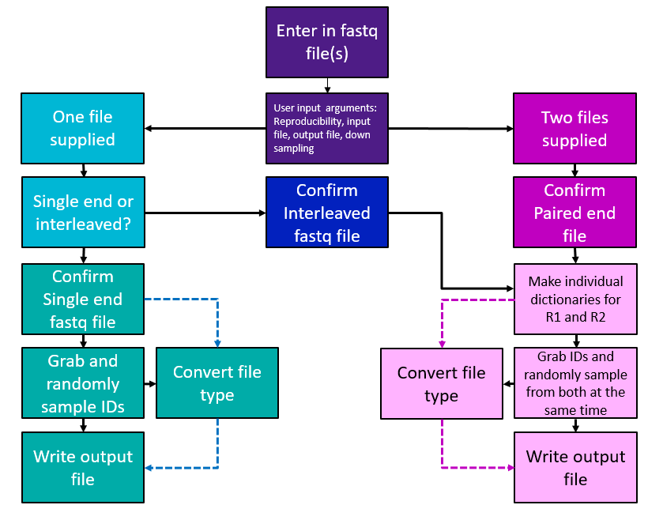

# SYLENS


**S**ampling **Y**ielding **LE**ss **N**oticeable **S**amples

## **SUMMARY**

Sylens is a Python program designed to intake user inputs through [**argparse**](https://docs.python.org/3/library/argparse.html) and alter the output with [**Bio.SeqIO**](https://biopython.org/wiki/SeqIO). This program not only allows for file output conversions based on user preferences, but can randomly down sample fastq files that have millions of reads for future analyses. 

-------------------------------------------------------------------------------------------------------------------------------------------------------------
## **TABLE OF CONTENTS:**

Summary

Usage

Program Outline

Output

Authors

-------------------------------------------------------------------------------------------------------------------------------------------------------------

## **USAGE**

Sylens requiers **Python 3.8.10** or greater to use. Decompressed and compressed paired-end, single-end, and interleaved fastq files are all file types that can be analyzed with Sylens. 

To begin Sylens with a paired-end file use:
```
Sylens.py FILE1.fastq FILE2.fastq
```

To begin with a single-end or interleaved file, use:
```
Sylens.py INTERLEAVED.fastq
```

File input type by default is fastq. However, if the input file format is not fastq, use the flag `-f` or `--filetype` with the input file's correct formatting. Currently Sylens supports fastq-sanger, also known as fastq format (ASCII 33), and fastq-solexa (ASCII 64).
```
Sylens.py FILE1.fastq -f fastq-solexa
```

Subsampling with Sylens is done through the `-s` or `--subsample` flag with the desired integer to down sample to.
```
Sylens.py FILE1.fastq -s 1000
```

Compressing or not compressing a file on output is done by using the `-c` flag. If a .gz file is input, the output will be .gz. By default, no compression occurs on output.
```
Sylens.py FILE1.fastq -c
```

By default, files output by Sylens are in fastq format. Changing output file formats is done by adding the `-o` or `--output` flag with the output file type you would like to convert to.
```
Sylens.py FILE1.fastq -o fastq-solexa
```

For reproducibility, Sylens provides a seed number. To denote a seed generated from a previous run, use the `--seed` flag with the seed number.
```
Sylens.py FILE1.fastq --seed 1691696502
```

If any additional explanations are needed, use the `-h` or `--help` flag.
```
Sylens.py FILE1.fastq --help
```

Multiple flags can be utilized in one line of code, if desired.
```
Sylens.py FILE1.fastq FILE2.fastq -s 1000 -c --seed 1691696502 -f fastq-solexa -o fastq
```

-------------------------------------------------------------------------------------------------------------------------------------------------------------
## **PROGRAM OUTLINE**



### **Legend**


-------------------------------------------------------------------------------------------------------------------------------------------------------------

## **OUTPUT**
Output files by default will be fastq files. If the output filetype indicated is differet than the input format, Bio.SeqIO will write it to the desired output.

## **AUTHORS**
[Eva Gunawan](https://github.com/evagunawan), Bioinformatics Fellow through APHL

[Kelsey Florek](https://github.com/k-florek), WSLH Senior Genomics and Data Scientist
