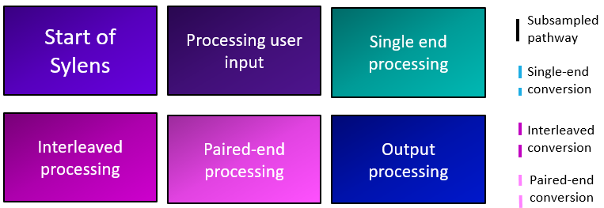

# SYLENS


**S**ampling **Y**ielding **LE**ss **N**oticeable **S**amples

Have ***too*** many reads? It's not a problem anymore!

## **SUMMARY**

Sylens is a Python program designed to intake **FASTQ** files and user inputs through [**argparse**](https://docs.python.org/3/library/argparse.html) and alter the FASTQ file output with [**Bio.SeqIO**](https://biopython.org/wiki/SeqIO). This program not only allows for file output conversions based on user preferences, but can randomly down sample FASTQ files that have millions of reads based on a user supplied integer or subsampled based on a percentage of reads. 

---
## **TABLE OF CONTENTS:**

Summary

Table of Contents

Program Outline

Usage

Output

Bug Reporting

Known Issues

Authors

---

## **PROGRAM OUTLINE**


Sylens works by analyzing the ID configuration of the supplied FASTQ file(s). Currently, Sylens can analyze NCBI, Illumina, and Casava formatted FASTQ files. The program then determines if the input file is an interleaved or single end file. If two files are input, Sylens will ensure that the required positional file is a forward file and the second file is a reverse file. If subsampling is desired, it will randomly subsample the FASTQ files and generate a seed for the run. This seed can be used to reproduce results, if desired. File formatting can be converted to and from ASCII 64 (FASTQ-solexa) and ASCII 33 (sanger) formats. The files can be written in both compressed and uncompressed format. 

### **Legend**


---

## **USAGE**

Sylens requiers **Python 3.8.10** or greater to use. Decompressed and compressed paired-end, single-end, and interleaved FASTQ files are all file types that can be analyzed with Sylens. 

To begin Sylens with a paired-end file use:
```
Sylens_main.py FILE1.fastq FILE2.fastq
```

To begin with a single-end or interleaved file, use:
```
Sylens_main.py INTERLEAVED.fastq
```

File input type by default is FASTQ. However, if the input file format is not FASTQ, use the flag `-f` or `--filetype` with the input file's correct formatting. Currently Sylens supports FASTQ-sanger, also known as FASTQ format (ASCII 33), and FASTQ-solexa (ASCII 64).
```
Sylens_main.py FILE1.fastq -f fastq-solexa
```

Subsampling with Sylens is done through the `-s` or `--subsample` flag with the desired integer to down sample to.
```
Sylens_main.py FILE1.fastq -s 1000
```

By default Sylens will subsample to the exact integer indicated after the `-s` flag. If a percentage is preferred, use the flag `-p` or `--percentage` with the subsample integer to take a percentage of the samples.
```
Sylens_main.py FILE1.fastq -p -s 10
```

Compressing a file on output is done by using the `-c` flag. If a .gz file is input, the output will automatically be .gz. By default, no compression occurs on output.
```
Sylens_main.py FILE1.fastq -c
```

By default, files output by Sylens are in sanger FASTQ format. Changing output file formats is done by adding the `-o` or `--output` flag with the output file type you would like to convert to.
```
Sylens_main.py FILE1.fastq -o fastq-solexa
```

For reproducibility, Sylens provides a seed number. To denote a seed generated from a previous run, use the `--seed` flag with the seed number.
```
Sylens_main.py FILE1.fastq --seed 1691696502
```

If any additional explanations are needed, use the `-h` or `--help` flag.
```
Sylens_main.py FILE1.fastq --help
```

Multiple flags can be utilized in one line of code, if desired. For example, this line of code reproduces the results from a pervious run with a seed = 1691696502 for paired end FASTQ-solexa files, downsamples to 10%, and writes the output to a compressed FASTQ sanger file.
```
Sylens_main.py FILE1.fastq FILE2.fastq -p -s 10 -c --seed 1691696502 -f fastq-solexa -o fastq
```

---

## **OUTPUT**

Output files by default will be written in ASCII 33 FASTQ format. If the output filetype indicated is differet than the input format, Bio.SeqIO will write it to the desired output. Currently two formats are supported: ASCII 64 (fastq-solexa) and ASCII 33 (sanger). If subsampling occurs, the seed value will be stored in the file name.

#### Subsampling output name formatting is :
```
{Seed Value}_downsampled_{Original File name} 
```

#### No subsampling output name formatting is :
```
non_downsampled_{Original file name}
```

---

## **Bug Reporting**

Find a bug? Let me know! I'm still learning so any additional guidance, comments, and suggestions would be welcomed! Please file a new issue with a title and description of the bug in the Sylens repository. If you have a solution to the issue, I would love to review your request! 

---

## **Known Issues**

None, at the moment! But if you find one, please refer to "Bug Reporting".

---
## **AUTHORS**
[Eva Gunawan](https://github.com/evagunawan), Bioinformatics Fellow through APHL

Mentored by:
[Kelsey Florek](https://github.com/k-florek), WSLH Senior Genomics and Data Scientist
