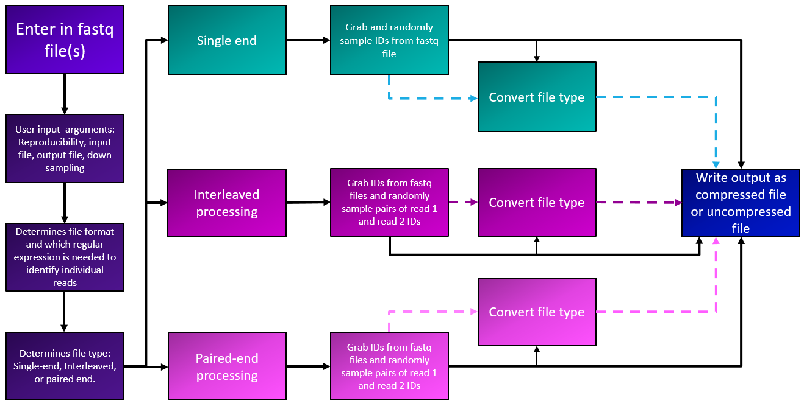

# SYLENS


**S**ampling **Y**ielding **LE**ss **N**oticeable **S**amples

Have ***too*** many reads? It's not a problem anymore!

#DockerCompatible

## **SUMMARY**

Sylens is a Python program designed to intake **FASTQ** files and user inputs through [**argparse**](https://docs.python.org/3/library/argparse.html) and alter the FASTQ file output with [**Bio.SeqIO**](https://biopython.org/wiki/SeqIO). This program not only allows for file output conversions based on user preferences, but can randomly down sample FASTQ files that have millions of reads based on a user supplied integer or subsampled based on a percentage of reads. 

---
## **TABLE OF CONTENTS:**

Summary

Program Outline

Usage

Output

Bug Reporting

Known Issues

Authors

---

## **PROGRAM OUTLINE**



Sylens works by analyzing the ID configuration of the supplied FASTQ file(s). Currently, Sylens can analyze NCBI, Illumina, and Casava formatted FASTQ files. The program then determines if the input file is an interleaved or single end file or processes paired end files. If subsampling is desired, it will randomly subsample the FASTQ files and generate a seed for the run. This seed can be used to reproduce results, if desired. File formatting can be converted to and from ASCII 64 (FASTQ-solexa) and ASCII 33 (sanger) formats. The files can be written in both compressed and uncompressed format. 

### **Legend**


---

## **USAGE**

Sylens requiers **Python 3.8.10** or greater to use. Decompressed and compressed paired-end, single-end, and interleaved FASTQ files are all file types that can be analyzed with Sylens. 

To begin Sylens with a paired-end file in the command line interface, use:
```
sylens FILE1.fastq FILE2.fastq
```

To begin with a single-end or interleaved file, use:
```
sylens INTERLEAVED.fastq
```

File input type by default is FASTQ. However, if the input file format is not FASTQ, use the flag `-f` or `--filetype` with the input file's correct formatting. Currently Sylens supports FASTQ-sanger, also known as FASTQ format (ASCII 33), and FASTQ-solexa (ASCII 64).
```
sylens FILE1.fastq -f fastq-solexa
```

Subsampling with Sylens is done through the `-s` or `--subsample` flag with the desired integer to down sample to.
```
sylens FILE1.fastq -s 1000
```

By default Sylens will subsample to the exact integer indicated after the `-s` flag. If a percentage is preferred, use the `-p` or `--percentage` flag to take a percentage of the samples.
```
sylens FILE1.fastq -p 10
```

Compressing a file on output is done by using the `-c` or `--compression` flag. If a .gz file is input, the output will automatically be .gz. By default, if the input file is compressed, the output file will be compressed.
```
sylens FILE1.fastq -c
```

By default, files output by Sylens are in sanger FASTQ format. Changing output file formats is done by adding the `-o` or `--output` flag with the output file type you would like to convert to.
```
sylens FILE1.fastq -o fastq-solexa
```

For reproducibility, Sylens provides a seed number. To denote a seed generated from a previous run, use the `--seed` flag with the seed number as well as the previously entered subsampling information, if applicable. 
```
sylens FILE1.fastq --seed 1691696502 -s 1000 -f fastq-solexa -o fastq
```

If any additional explanations are needed, use the `-h` or `--help` flag.
```
sylens --help
```

If entering an interleaved file or pair end files, the way the output is written can be changed with `--output_type`. Currently there are 3 written output types: separate, joined, and interleaved. `--output_type separate` produces two files, a read 1 file and read 2 file. `--output_type joined` produces one file with all read 1 entries first and then all read 2 entries second. `--output_type interleaved` produces an alternating pattern of read 1 and read 2 in one file. By default, files are separated.   
```
sylens INTERLEAVED.fastq --output_type interleaved
```

Multiple flags can be utilized in one line of code, if desired. For example, this line of code reproduces the results from a previous run with a seed = 1691696502 for paired end FASTQ-solexa files, downsamples to 10%, and writes the output in one compressed FASTQ sanger file with all read 1 entries first and read 2 entries last.
```
sylens FILE1.fastq FILE2.fastq -p 10 -c --seed 1691696502 -f fastq-solexa -o fastq --output_type joined
```

If no downsampling is desired, Sylens will give the ability to not downsample but change the written output. In this example the fastq-solexa interleaved file will not be downsampled and will be written as two sanger fastq files with all read 1 entries in one file and all read 2 entries in a second file.
```
sylens INTERLEAVED.fastq -f fastq-sanger -o fastq --output_type separate
```

---

## **OUTPUT**

Output files by default will be written in ASCII 33 FASTQ format. If the output filetype indicated is different than the input format, Bio.SeqIO will write the desired output formatting. Currently two formats are supported: ASCII 64 (fastq-solexa) and ASCII 33 (sanger). If subsampling occurs, the seed value will be stored in the file name. In cases where `--output_type joined` or `--output_type interleaved` is utilized, file names will indicate their output type in the name of the file. Depending on the use case, Sylens may generate a read 2 file name if no read 2 file is input but desired on output. 

#### Subsampling file naming convention :
```
{Seed Value}_downsampled_{Original File name} 
```

#### By default Sylens will use `--output_type separate`. If no read 2 file is supplied i.e. using an interleaved input file, Sylens will generate the read 2 file naming convention based off of the original read 1 file name: 
```
{Seed Value}_downsampled_Read2_{Read 1 File name}
```

#### Subsampling with `--output_type interleaved` uses the file naming convention of :
```
interleaved_{Seed Value}_downsampled_{Original File name}
```

#### Subsampling with `--output_type joined` uses the file naming convention of :
```
joined_{Seed Value}_downsampled_{Original File name}
```

#### No subsampling uses the file naming convention of :
```
non_downsampled_{Original file name}
```

---

## **Bug Reporting**

Find a bug? Let me know! I'm still learning so any additional guidance, comments, and suggestions would be welcomed! Please file a new issue with a title and description of the bug in the Sylens repository. If you have a solution to the issue, I would love to review your request! 

---

## **Known Issues**

None at the moment.

---
## **AUTHORS**
[Eva Gunawan](https://github.com/evagunawan), Bioinformatics Fellow through APHL

Mentored by:
[Kelsey Florek](https://github.com/k-florek), WSLH Senior Genomics and Data Scientist